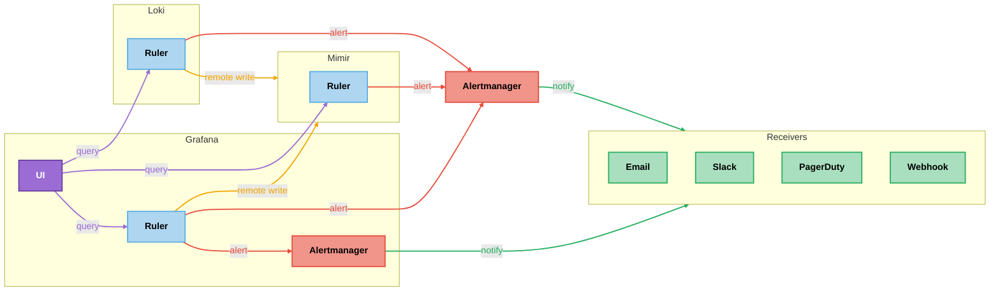

# Alerting

## Architecture

In modern telemetry systems, alerting is usually split into two responsibilities:

  - **Ruler**: Evaluates alert and recording rules against a specific data source on a schedule.
  - **Alertmanager**: Receives fired alerts and handles routing, grouping, deduplication, silencing, and notification delivery.

This separation keeps rule evaluation close to the data while centralizing notification logic.

### Ruler

Rulers are intentionally backend-specific.

Metrics and logs live in different systems, use different query languages, and have different schemas.
Because of this, each backend provides its own ruler implementation:

  - **Mimir Ruler** evaluates PromQL rules against Mimir data.
  - **Loki Ruler** evaluates LogQL rules against Loki data.

In distributed or HA deployments, rulers are also distributed. A ruler cluster typically:

  1. Loads rules from a shared rule store.
  2. Evaluates rules on a fixed interval.
  3. Writes recording rule results back to the backend.
  4. Sends fired alert instances to Alertmanager.

This design scales with the data plane and avoids a central evaluator bottleneck.

### Alertmanager

A single Alertmanager deployment can receive alerts from many rulers, and this is common in smaller or self-managed environments.

In larger platforms, teams often run Alertmanager per backend or per tenant (or use Alertmanager-compatible services) for practical reasons:

  1. **Tenant isolation:** Separate routing rules, silences, and receiver credentials per tenant.
  2. **Operational boundaries:** Easier ownership and lifecycle management when alerting stays close to each backend.
  3. **Compatibility constraints:** Some managed backends provide integrated alert-routing components designed for that stack.

## Alerting Systems

### Mimir Alerting

Mimir's ruler evaluates alert rule `expr` fields as **PromQL**.
Mimir alert rules operate directly on metric data and can reference recording rules by name.

Mimir recording rules periodically evaluate expressions against metrics and write the results back to Mimir as new metrics.
This allows precomputing expensive or frequently-used queries, improving the performance of querying and alerting.

> For demonstration purposes, this stack includes both Mimir recording and alerting rules.

### Loki Alerting

Loki's ruler evaluates alert rule `expr` fields as **LogQL**, not PromQL.
That means Loki alert rules operate directly on log-derived queries and
cannot reference recording rule metrics by name the way Prometheus/Mimir alert rules can.
If you want a Loki-managed alert, you must place the full LogQL expression in the alert rule itself.

Loki recording rules serve a different purpose: they periodically evaluate LogQL metric expressions
and export the resulting metrics through remote write to a metrics backend such as Mimir.
When a log-based expression is expensive or reused often, use a Loki recording rule to precompute it,
write the result to Mimir, and alert on that metric from a metrics ruler such as Mimir's or Grafana's.

> For demonstration purposes, this stack includes both Loki-managed recording and alerting rules.
> In practice, most operational alerts are better expressed from metrics such as error rate, latency, or throughput.

### Grafana Alerting

Grafana ships with a built-in alerting system — *Grafana Alerting* — that combines a ruler and an Alertmanager.

#### Grafana Ruler

Grafana ruler is embedded in the Grafana server.
It evaluates alert rules on a schedule against any configured datasource
(*Prometheus*, *Mimir*, *Loki*, *MySQL*, *Postgres*, and more) using Grafana's own query engine.
This makes it the only ruler in the *LGTM* stack that can fire alerts based on non-metric data sources.

There are two types of alerts in Grafana:

  - **Grafana-Managed** (recommended)
    - Supports any configured data source, including multiple sources per rule.
    Enables expression-based transformations, rich alert conditions, notification images, and configurable behavior.
  - **Data source-managed**
    - Limited to Prometheus-compatible backends (Mimir, Loki, Prometheus).
    - Rules are stored and evaluated directly in the data source.

> For demonstration purposes, this stack uses both Grafana-managed and datasource-managed rules,
> and can route Grafana-managed alerts to both the built-in Alertmanager and an external one.

#### Grafana Alertmanager

Grafana Alertmanager is an extension of the *Prometheus Alertmanager* built into the same process.
It appears as *Grafana* in the UI and it can only handle **Grafana-managed** alerts.
It handles routing, contact points, and notification policies for all **Grafana-managed** alerts.

#### External Alertmanager

Grafana can be configured to forward all Grafana-managed alerts to an external Alertmanager, such as a standalone Prometheus Alertmanager.
Mimir and Loki rulers can independently send their alerts to the same external Alertmanager,
allowing a single instance to receive both Grafana-managed and datasource-managed alerts.
Each Alertmanager maintains its own independent routing rules, receivers, and silences.

To forward only specific Grafana-managed alerts rather than all of them,
configure the external Alertmanager as a contact point and assign it to the relevant notification policies.

## Provisioning

When provisioning an observability stack such as LGTM, you also need to provision your recording rules, alerting rules, and dashboards.
A common best practice is to keep infrastructure provisioning separate from data provisioning,
treating rules and dashboards as configuration that evolves independently of the underlying platform.

There are several approaches to consider:

  - **YAML files**: Load declarative configuration files at startup or apply them through a live config reload.
    This is the approach used in this setup for demonstration purposes.
  - **Terraform**: Manage rules and dashboards as Terraform resources alongside your infrastructure.
    This keeps everything version-controlled and auditable, and works very well when your infrastructure is already managed by Terraform.
  - **API or CLI**: Push configuration directly to each component's HTTP API or through a dedicated CLI.

## Integrations

### Email

Grafana's Email contact point does not treat the `message` field as raw HTML.
If you add HTML tags, Grafana escapes them for safety, so the tags appear as plain text in the email.
You can customize the subject and text content, but you cannot edit HTML or CSS.

### Slack

To integrate with Slack, first create a Slack app, install it in your workspace,
and add it to the channels where it should post alerts (`#alerts`).
Follow the instructions in [slack](../slack/README.md) to create and configure a new Slack app.

Prometheus Alertmanager and Grafana's built-in Alertmanager do not currently support Slack Block Kit.
See [Prometheus issue #2217](https://github.com/prometheus/alertmanager/issues/2217)
and [Grafana issue #82843](https://github.com/grafana/grafana/issues/82843).

If you need *Block Kit* formatting, use `webhook_config` to forward alert notifications to an intermediary service.
That service can receive the webhook payload, construct a *Block Kit* message,
and send it to Slack through the Web API using `chat.postMessage`.
This requires a proper Slack app with the `chat:write` scope instead of an *Incoming Webhook*.

## Resources

  - **Mermaid**
    - [Syntax and Configuration](https://mermaid.js.org/intro/syntax-reference.html)
    - [Flowchart](https://mermaid.js.org/syntax/flowchart.html)
  - **Prometheus**
    - [Alerting](https://prometheus.io/docs/practices/alerting)
    - [Recording rules](https://prometheus.io/docs/practices/rules)
  - **Alertmanager**
    - [Alertmanager](https://prometheus.io/docs/alerting/latest/alertmanager)
    - [High Availability](https://prometheus.io/docs/alerting/latest/high_availability)
  - **Loki**
    - [Alerting](https://grafana.com/docs/loki/latest/alert)
    - [Recording Rules](https://grafana.com/docs/loki/latest/operations/recording-rules)
  - **Mimir**
    - [Ruler](https://grafana.com/docs/mimir/latest/references/architecture/components/ruler)
    - [Alertmanager](https://grafana.com/docs/mimir/latest/references/architecture/components/alertmanager)
  - **Grafana**
    - [Introduction to Grafana Alerting](https://grafana.com/docs/grafana/latest/alerting/fundamentals)
    - [Configure alert rules](https://grafana.com/docs/grafana/latest/alerting/alerting-rules)
      - [Create recording rules](https://grafana.com/docs/grafana/latest/alerting/alerting-rules/create-recording-rules)
    - *Configure notifications*
      - [Configure contact points](https://grafana.com/docs/grafana/latest/alerting/configure-notifications/manage-contact-points)
      - [Configure notification policies](https://grafana.com/docs/grafana/latest/alerting/configure-notifications/create-notification-policy)
    - *Templates*
      - [Template annotations and labels](https://grafana.com/docs/grafana/latest/alerting/alerting-rules/templates)
      - [Template notifications](https://grafana.com/docs/grafana/latest/alerting/configure-notifications/template-notifications)
    - *Screenshots*
      - [Set up image rendering](https://grafana.com/docs/grafana/latest/setup-grafana/image-rendering)
      - [Use images in notifications](https://grafana.com/docs/grafana/latest/alerting/configure-notifications/template-notifications/images-in-notifications)
    - [Configure Alertmanagers](https://grafana.com/docs/grafana/latest/alerting/set-up/configure-alertmanager)
    - [Provision Alerting resources](https://grafana.com/docs/grafana/latest/alerting/set-up/provision-alerting-resources)
