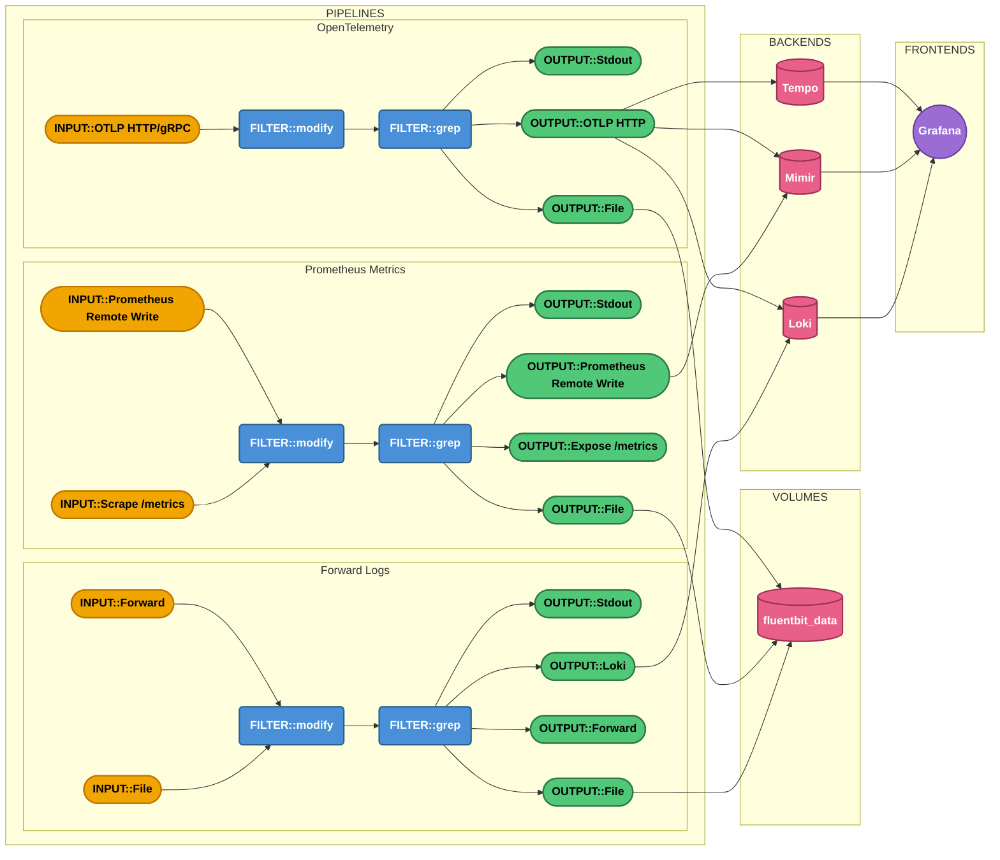
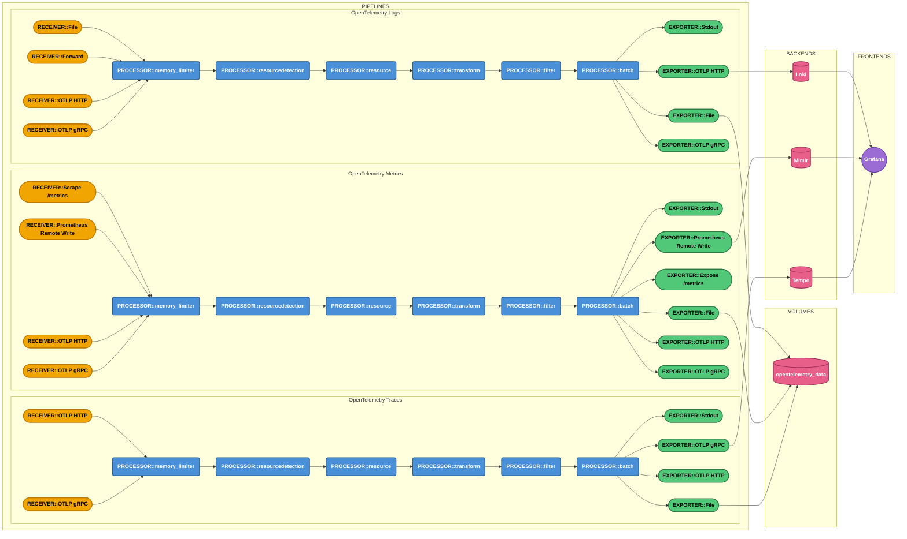
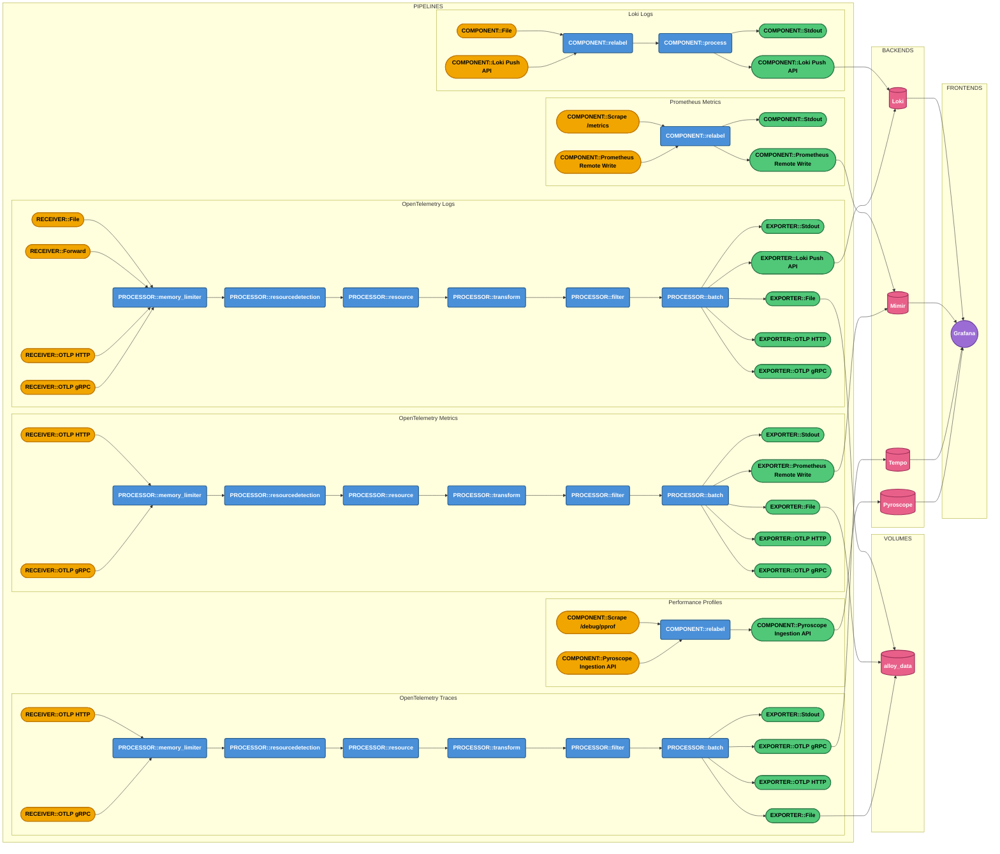

# Data Pipelines

## Diagrams

### Fluent Bit

### OpenTelemetry Collector

### Grafana Alloy

## Considerations

### Scraping Telemetry Data

In this setup, all scraping configurations for metrics and performance profiling data are centralized in Alloy.
Alloy acts as the single collector responsible for scraping `/metrics` and `/debug/pprof` endpoints across all services,
then shipping the collected data to the respective storage backends (*Mimir* for metrics, *Pyroscope* for profiles).

In a real-world production environment, this centralized approach will not scale well.
Depending on your telemetry data pipeline architecture and the number of services you operate,
distributing the collection workload across multiple collector instances is strongly recommended.

A common pattern for distributed collection is the **sidecar architecture**,
where a dedicated collector instance (e.g., Alloy) is deployed alongside each container within every pod.
Each sidecar scrapes metrics and pprof data exclusively from `localhost`,
ensuring it only collects telemetry from the co-located service.
The data is then forwarded to a central aggregator or shipped directly to the storage backends.

## Resources

  - **Mermaid**
    - [Syntax and Configuration](https://mermaid.js.org/intro/syntax-reference.html)
    - [Flowchart](https://mermaid.js.org/syntax/flowchart.html)
